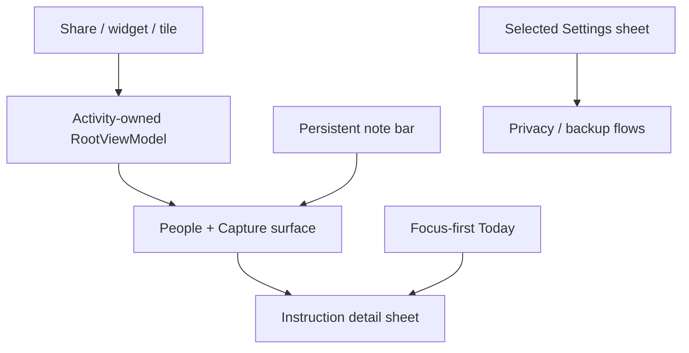

# KaavalanNote — Focus-first UX redesign

**Status:** implemented on the v2.2 work branch; CI validation pending
**Scope:** v2.2 UX and reliability pass
**Non-negotiables:** local-first working data, three primary destinations, one capture entry point, no shame-oriented urgency language, and no new telemetry or third-party inference.

## Why this change

KaavalanNote already has strong individual features, but the primary surfaces compete for attention. The existing Today screen can start with activity summaries, quiet-contact prompts, worry items, and meeting context before the instruction that needs action. Home also presents two prominent creation paths (the note bar and an add-person FAB), and Android share/widget capture events can be disconnected from the screen that consumes them.

The redesign makes the app answer one question immediately: **what is the next useful action?** Context remains available, but it never obscures the action path.

## Information architecture

| Destination | User intent | First thing shown | Secondary content |
|---|---|---|---|
| **People** | Find context, a person, or an existing instruction | Searchable people list | Incoming/outgoing lanes and tags, below people |
| **Today** | Decide what to do next | One focused instruction | Remaining needs, waiting items, carried items, then context and reflections |
| **Settings** | Adjust the private workspace | Configuration sheet with its navigation item visibly selected | Backup, privacy, appearance, and support surfaces |

Capture stays persistent above the primary navigation. It is the only large creation affordance; adding a person moves to the People header and the empty-state action so it does not compete with capturing the thought.

## Interaction model

### Today: focus first

1. Select the first `needsYouToday` instruction; if there is none, select the first `waitingOnOthers` item.
2. Render it as a single **Start here** card. Tapping it opens the existing instruction detail sheet, keeping the action model consistent.
3. Render any remaining instructions in clear sections: **Needs your attention**, **Waiting on others**, and **Carried over**.
4. Render reflective/contextual tools only after the action path: today’s summary, meeting brief, quiet contacts, and worry review.

The app does not assert an objectively correct priority; it provides one calm starting point using the existing brief ordering and lets the officer decide in the detail sheet.

### People: directory first

- Show people before tags, inbox, and outbox.
- Keep each row compact but preserve meaningful state: `N open` and the quiet-follow-up indicator both retain accessible descriptions.
- Use a header add action rather than a floating action button. The capture bar is therefore unmistakably the primary action.

### Settings: explicit selection

Settings remains a temporary configuration sheet so it does not create a fourth working surface, but choosing it now marks the Settings navigation item as selected while the sheet is open.

## UI architecture

- `RootViewModel` is activity-scoped because it represents one-shot Android ingress events. The exact same instance is passed to `HomeScreen`; a navigation-scoped replacement must not consume those events.
- Screen state remains in its existing Hilt view models. This pass deliberately introduces no schema, migration, sync, or repository change.
- Existing instruction detail, capture, backup, vault, and dispatch paths are reused rather than duplicated.

## Reliability and accessibility contract

- Share text and quick-capture events open the actual capture sheet exactly once; rotation must not recreate them.
- Every interactive new control has visible text or a meaningful accessibility label.
- Existing no-red / no-overdue / no-streak rules remain intact.
- The redesign adds no network call. The SQLCipher database remains the working store; the existing opt-in, client-side-encrypted Drive backup remains a recovery feature rather than live sync.
- Tests cover the activity-ingress event model and the source-level wiring from the app shell to Home.

## Acceptance checks

1. A share or quick-settings action reaches the visible Home capture sheet.
2. The current focus instruction appears before activity summaries and secondary context on Today.
3. There is one large capture action on People; add-person remains reachable from the header and empty state.
4. Settings visibly reports selection while its sheet is open.
5. Unit tests, lint, and a debug assemble pass in CI; no unrelated data-layer behavior changes.
